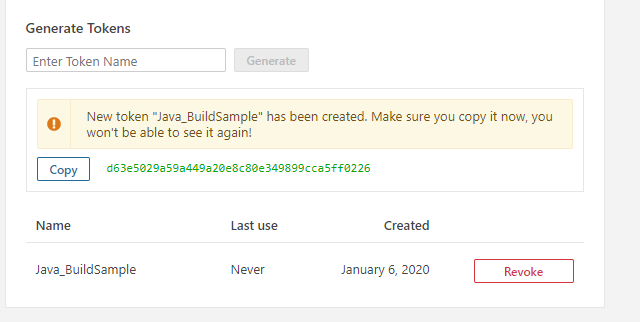

# Java Build Sample


[](https://sonarcloud.io/dashboard?id=Java_BuildSample)

A small demo program to demonstrate the functionality of local sonarqube analysis with a docker container.

## Deployment

### Build Project
Execute the gradle Tasks
```
gradle build
```

### Unit Tests
Excecute the unit Tests
```
gradle test
```

### Generate Jacoco Test Coverage Report
Excecute this script to generate the coverage report
```
gradle test jacocoTestReport
```

The coverage report can be found at /build/reports/jacoco/test/html/index.html

### Run Code Analysis

Run Code Analysis with local docker Sonarqube server

#### Pull Docker image from Docker Hub
```
docker pull jonny9904/docker-sonarqube-custom_profile
```

#### Start Docker Container from image
```
docker run -d --name docker-sonarqube-custom_profile -p 9000:9000 jonny9904/docker-sonarqube-custom_profile
```
#### Generate Access Token
Visit http://localhost:9000/account/security/

***
> User: admin
> Password: admin
***



Copy the token and paste it into the build.gradle file
```
sonarqube {
    properties {
        property "sonar.projectKey", "Java_BuildSample"
        property "sonar.host.url", "http://localhost:9000"
        property "sonar.login", "d63e5029a59a449a20e8c80e349899cca5ff0226"
    }
}
```
then add sonarqube to your plugins in build.gradle file
--> **id "org.sonarqube" version "2.8"**
```
plugins {
    id 'java'
    id 'jacoco'
    id "org.sonarqube" version "2.8"
}
```

Start your analysis with gradle
```
gradle sonarqube
```

Report can be accessed on http://localhost:9000/dashboard?id=Java_BuildSample or online at SonarCloud.io https://sonarcloud.io/dashboard?id=Java_BuildSample
